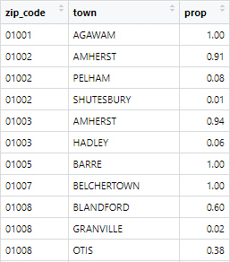
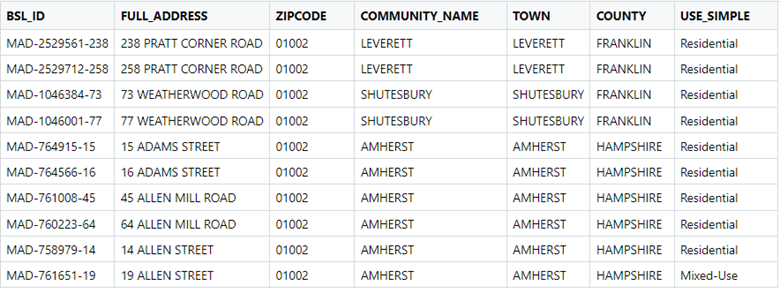

# Creating a Zip Code Crosswalk File

Because USAC provides information at the zip code level, I was faced with the problem of having to figure out how to assign geographic value to the data. 02467, for example, is a zip code associated with Chestnut Hill. But Chestnut Hill is not an incorporated entity. Someone living in Chestnut Hill might be located in Boston, in Brookline, or in Newton. So that’s three different municipalities for one zip code! This makes it hard for me to know what to do about USAC telling me there were 172 ACP subscribers in that Zip as of April 2023. USAC itself probably has granular address data for each enrolled household, so they likely know exactly what city or town each of those 172 ACP subscribers fall under. But the way they’ve chosen to share this data publicly does create a problem the rest of us need to overcome (if someone from USAC is reading this, please consider providing information at the Census Block or Block Group level instead—I’ll even settle for Census Tract!).

In order to address this issue, I’ve chosen to apportion subscribers in a zip code to the municipalities that share in that zip. For the Chestnut Hill example, I would divide the 172 subscribers into Boston subscribers, Brookline subscribers, and Newton subscribers. But these three places don’t get the same allocation of subscribers. Instead, the allocation happens according to the proportion of locations that exist in each municipality, in that zip code.

## Calculating attributable town proportions

The Massachusetts Broadband Institute has developed the state’s first Broadband Serviceable Location Fabric (BSL). It’s an ambitious (and still in progress) attempt to list every single residential location in Massachusetts with the goal of making sure everyone has access to a broadband connection.

Conveniently, the BSL provides us with the full address of each location it has identified, including the zip code associated with the address and the town (or city) as well. In the example figure above, we can see 10 addresses. These addresses all share the same zip code (01002) but they’re spread across three towns (Leverett, Shutesbury, and Amherst).

By grouping this information at the [zip code-town] level, and counting how many observations exist for each [zip-town] combination, I’m able to generate a rough estimate of how I should apportion subscribers in any given zip. For example, if the figure above were to represent the entirety of addresses that exist in 01002, then our estimate would look like this:

Zip Code | Second Header | Number of Addresses | \% of Total
------------- | ------------- | ------------- | -------------
01002 | Leverett  | 2 | 20
01002 | Shutesbury | 2 | 20
01002 | Amherst | 6 | 60

As of April 2023, USAC reports 641 ACP subscribers in zip 01002. According to the proportions I just calculated, my best guess is that 128.2 (20%) subscribers fall in Leverett, 128.2 (20%) fall in Shutesbury, and 384.6 (60%) fall in Amherst. Of course, this is just a guess—maybe all of the subscribers are actually in Amherst! But I think it’s a fair guess based on the information we have available. And though it’s a little silly to include decimals when we’re talking about households (after all, there is no such thing as 0.2 households enrolling in a program), I made a conscious decision to keep them in there, rather than round up the values, to make it more clear that these are calculated numbers that have gone through some processing. 

In reality, this is what the proportions table looks like for 01002:

Zip Code | Second Header | Number of Addresses | \% of Total
------------- | ------------- | ------------- | -------------
01002 | Leverett  | 8 | 0.1
01002 | Shutesbury | 97 | 1.3
01002 | Amherst | 6567 | 91
01002 | Pelham | 552 | 7.6

The Leverett proportion is so small (less than half a percentage point) that it gets dropped from our estimates, and so 01002 subscribers will get divided between Shutesbury, Amherst, and Pelham.

These attribution decisions play an important role when aggregating the data at the municipal level. Towns may want to know how many subscribers exist in their borders, so being able to include some approximation is important, even if zip codes make things a little blurry sometimes. 

The dashboard also displays information as granularly as it can by additionally showing zip code counts, which do not need to undergo any sort of apportioning because a zip is a zip, and we can’t go deeper than that. However, the zip code display does include information about “Primary” and “Other” towns, to allow people to see, in one place, all zips that are relevant to their town. Whether a municipality is designated as “Primary” or as “Other” depends solely on which town has the highest proportion allocated to it within a zip code.

## Filling in the Gaps

In an effort to be as comprehensive as possible with zip codes, I searched for additional sources of zips beyond the BSL, in case the BSL missed some historical or special zips.
I was able to find some additional zips through the sources I list at the start of this section, and these zips—and their respective towns—were added to the zip code crosswalk. Because I didn’t have the BSL to figure out if multiple towns were sharing these new zips, whatever information existed or I was able to find regarding location received 100% allocation of subscribers. For example, the Missouri Census Data Center has a record for zip code 01009 in Bondsville, MA. Using a resource called the “Archaic Community, District, Neighborhood Section and Village, Names in Massachusetts” provided by the Secretary of the Commonwealth, I learned that Bondsville is an archaic name for the town of Palmer, MA. So 01009 got added to the crosswalk with 100% of locations falling in that zip code going towards Palmer.

